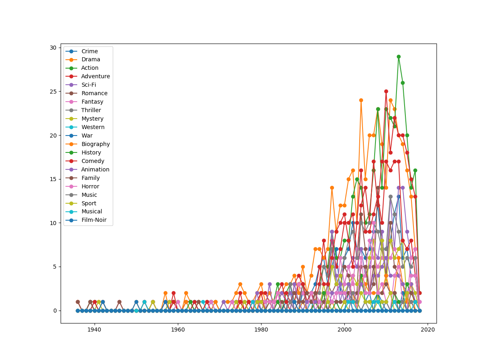

# Abstract

Data is a pretty powerful and important thing in life, it could be used to do a lot of things from things like predicting the price of a product, calculating the probability of disaster on one region or nation, calculating the result of an undergoing election and many more. Due to that there's some method involved in using and gathering data, first is what we know as Data Scraping in which we gather Data from a specific Domain, mainly a website and filter the element needed to get the result we want. After we get the Data the next thing we do is known as Data Visualization, in which we make the Data that we already gather which usually result in a format that eye can't properly read to a readable data. To make this data readable we use things like Chart which consist of a lot of things like for example bar chart, which are chart that are usually used to Discrite Data and visualize it as a bar that shows how much of the plot there, Line Chart, which are used by continous data and represent data as a line in which we can plot some of the data we gather and it will make a path from those Data. 

# Data Introduction

From the Data We've Scraped from IMDB before, which result in a json file that contains, title, rating, description, poster, genres, casts, and production years of the movie, Now we move to the second step of Data Mining, which is Data Visualization, to make the Data we've already scraped which result in a JSON file now readable by human eye. In this Article I will show one of the Data we've already Visualized which is the Line Chart of the Data which shows how much a movie genre is created on a certain year. The Graph we were talking about is down below this text.

# Graph

# Data Explanation

Graph Above shows the Data Plot of movie genres created from 1936 until 2018. In the Graph we could see some of the Data correspond differently as time progress. Movie genres such as Film-Noir just appear for a few year than dissapears completely while genres like Action Movies popularity sky rocketed until it reached 29 movie out of 1000 sample in a year on 2013. From the Data We alredy Scraped before we could find some descriptive statistic analysis like the mean of the data as what is shown below.  
Crime = 4.609756097560975  
Drama = 6.9523809523809526  
Action = 9.125  
Adventure = 7.0  
Sci-fi = 4.358974358974359  
Romance = 3.138888888888889  
Fantasy = 3.289473684210526  
Thriller = 4.923076923076923  
Mystery = 3.4  
Western = 1.0  
War = 1.2222222222222223  
Biography = 1.962962962962963  
History = 1.4782608695652173  
Comedy = 6.0227272727272725  
Animation = 2.4642857142857144  
Family = 1.7272727272727273  
Horror = 2.3666666666666667  
Music = 1.1111111111111112  
Sport = 1.2307692307692308  
Musical = 1.0  
Film-Noir = 1.0  

The Data we gathered could also potentially reveal which genre could be the most popular in the next year, in this graph however the most potential candidate is Action which despite popularity declined in the following year had the most data difference and had been increasing again, and drama, which has the most stable data increase 

# Conclusion
After we've analize the data, we got some conclusion. 
1. Action movie get the highest rating 
